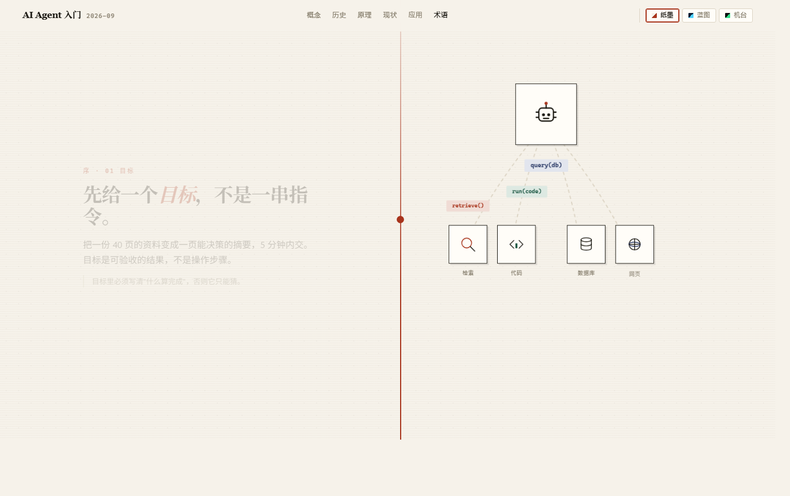
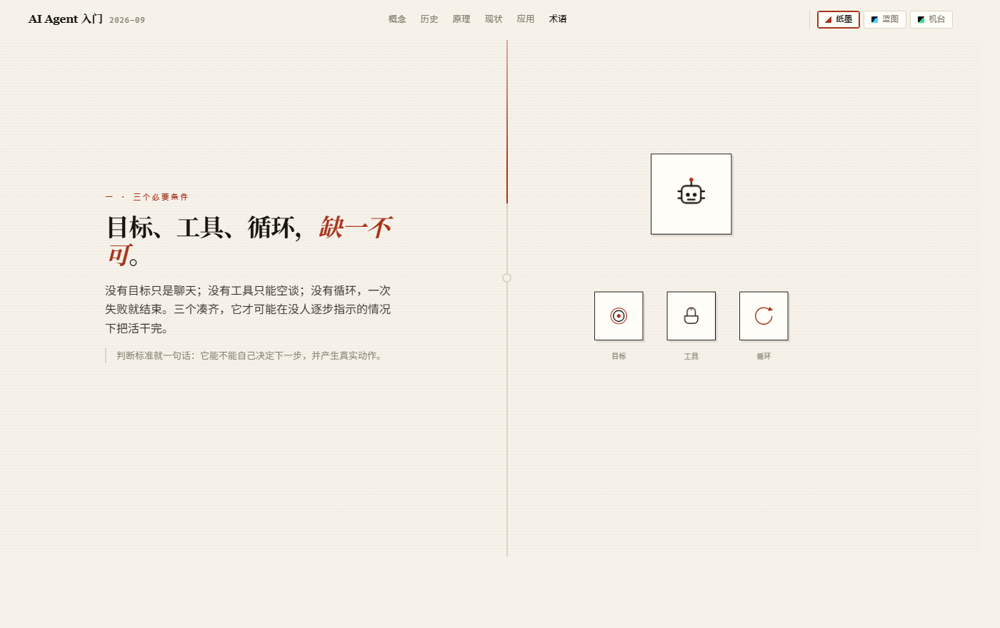

<div align="center">

# 🧭 AI Agent 入门

**一份能自己看懂、也能讲给别人听的 AI Agent 梳理**

它是什么 · 怎么走到今天 · 内部怎么运转 · 现在能做什么 · 能用在哪些地方

[](https://aayloo.github.io/Agent/)


</div>

---

## 📌 这是什么

一份关于 **AI Agent 的介绍与分析**，用一份可交互的单文件网页承载。目标是：看完之后你既懂概念，也能把它讲清楚。

它回答五个问题：

1. **Agent 到底是什么** —— 和聊天机器人的分界在哪；上下文、工具调用、记忆、skills、MCP、子智能体这些概念各自是什么
2. **它是怎么走到今天的** —— 哪三件事凑齐，才有了能用的 Agent
3. **内部怎么运转** —— 一次任务的执行循环、六层构成、单智能体与多智能体的取舍
4. **现在真能做什么** —— 哪些已经跑通，仍然卡在哪六个地方
5. **能用在哪些地方** —— 九个应用场景与成熟度，个人怎么开始上手

> **不写的内容**：产业格局、商业模式、融资与市场规模预测、产品排名。只讲概念、事实和可验证的判断。

## 🖼️ 预览

<p align="center">
  
</p>

<p align="center">
  
  
</p>

<p align="center"><sub>左边文字往下滚，右边舞台跟着演；图标自己也在动</sub></p>

## 🗂️ 内容结构

- **🚀 序 · 一次任务的生命周期**
  目标 → 拆解 → 调工具 → 观察 → 自检重试 → 交付与记忆。六步动画，建立整体直觉。

- **🧩 1 · 概念**
  三个必要条件（目标 / 工具 / 循环）；与聊天机器人的分界（能不能改变外部状态）；四层概念地图（构成 / 组织 / 工程 / 安全，含 skills、MCP、hooks、子智能体）；L0–L4 自主性阶梯；六组最容易混淆的概念对照。

- **🕰️ 2 · 历史**
  Transformer → 少样本学习 → 推理与行动 → 工具调用 → 多模态与计算机操作 → 编码 Agent 跑通与协议标准化 → 从"能演示"到"能交付"。含八节点可点时间轴与三条反复出现的教训。

- **⚙️ 3 · 原理**
  七步执行循环（可分步演示，每步标出最容易出错的地方）；六层构成（模型 / 上下文 / 记忆与状态 / 工具与协议 / 编排 / 评测治理）；单智能体还是多智能体；精度随步数衰减（十步各 95% → 约 60%）。

- **📊 4 · 现状**
  已经跑通的能力与仍然困难的部分；六个瓶颈（错误累积、缺少裁判、上下文与状态、权限与安全、成本与延迟、组织与流程）；判断能不能上线的三条依据。

- **🧭 5 · 应用**
  九个场景与成熟度（编程、客服与销售、深度研究、文档、数据分析、浏览器操作、通用助手、流程自动化、垂类行业）；两条上手路径；接下来值得盯的信号。

- **📚 附录 · 术语速查**
  30 条常用术语，输入关键词即可过滤。

## ✨ 特点

- **🎬 滚动叙事**：左侧文字推进，右侧粘性舞台换景，内容随滚动逐个出现
- **✨ 图标会动**：机器人眨眼、放大镜扫描、光标闪烁、数据下落、地球自转、闸门三色灯轮转、印章下压、对勾画出、记忆层叠入
- **🎨 三套皮肤**：纸墨（默认）/ 蓝图 / 机台，一键切换，选择会被记住
- **📦 单文件**：`index.html` 自包含，无外部依赖，双击即开，离线可用
- **🖨️ 可直接打印**：`Ctrl / ⌘ + P` 导出 PDF
- **♿ 尊重系统偏好**：跟随 `prefers-reduced-motion` 自动降级动效

## 🚀 打开与更新

```bash
# 本地打开
双击 index.html

# 在线看
https://aayloo.github.io/Agent/

# 更新（推送到 main 后 Pages 自动更新）
git add -A && git commit -m "update" && git push
```

## 🧱 目录

```text
Agent/
├── index.html              # 报告本体（单文件）
├── README.md
└── docs/
    ├── preview-hero.png
    ├── preview-stage.png
    └── preview-concept.png
```

## 📄 内容口径

- 区分「已经发生的工程事实」与「前瞻性判断」，判断类内容会明确标注
- 不使用市场规模、增长率等无法核实的数据；文中出现的数字用于说明结构（如五级阶梯、六层构成、九个场景）
- 全文零表格，属于叙事型阅读材料；需要速查的内容集中在附录术语表
